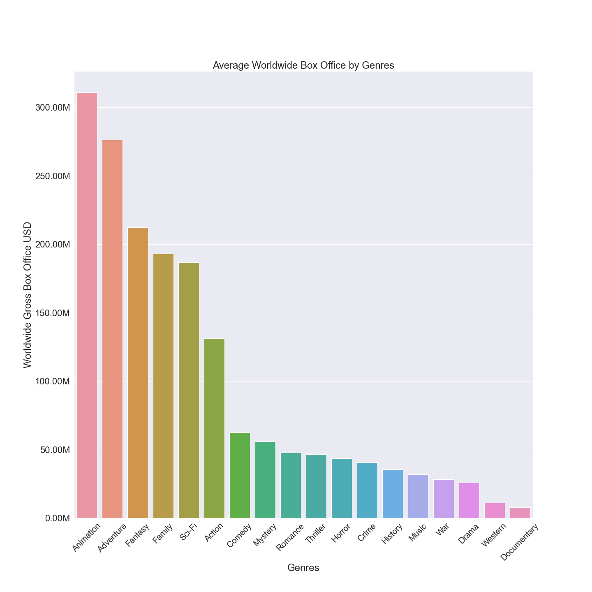
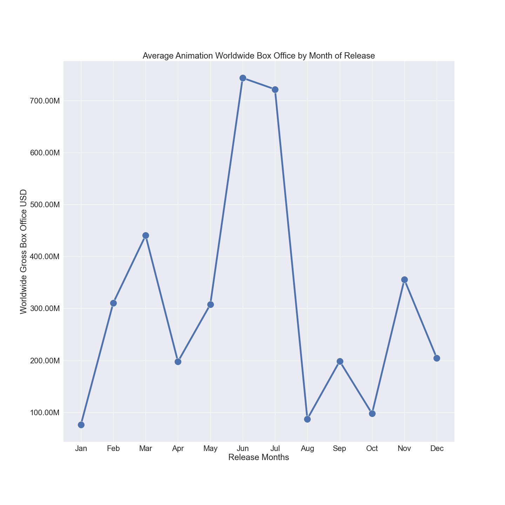

# Movie Trend Analysis

**Authors**: Wesley Yu

## Overview

This project analyzes data from various movie databases. Exploratory data analysis of the database shows how trends in movie release dates, genres, and production budget can effect the movie's worldwide box office results. Microsoft can use this analysis to help decide which film projects to take on.

## Business Problem

Microsoft is making their entry into the movie buisness and wants to know what kind types of films are currently dominating the box office. Using data from movie databases, we can find patterns and trends that can help Microsoft in deciding what movie to make how how to ensure it will be successful.

## Data

In this project, we will be looking at datasets from two sources. The Numbers and TMDB.
The Numbers has been tracking data about the movie industry since 1997, having the most up to date information on box office numbers and movie financials.
TMDB is a community built and backed database on movies and TV shows. Data is constanly added and updated by a strong community that is passionate about movie and TV show data.
We will be looking at data from movies released from 2009 to now. The main variables we will be examing are genre, release date, and production budget of various movies.

## Methods

This project uses descriptive analysis to find measures of central tendency in different variables that contribute to a movie's success. 

## Results

The movies with animation genre has been shown to have higher worldwide box office gross than other genre categories.


Movies released in the summer months May, June, July and end of year holiday months November and December are shown to have higher worldwide box office gross.


Movies in the animation genre follow similar trend, with the highest revenue in the months of June and July.


Production budget and worldwide box office gross have a positive correlation. As production budget increases worldwide box offfice gross increases as well.


Animation genre has lower average production budget than Fantasy and Adventure. But it had higher average box office revenue.


## Conclusions

This analysis leads to three recommendations to help Microsoft in deciding what movies to make:

- __Type of movie.__ While there are alot of different genres and sub genres in movies now. Movies with higher box office totals have shown to be of the animation genre.

- __Time of release.__ The months of June, July have shown to have brought back higher box office revenue for Animation movies.

- __Price of success.__ Analysis shows spending a minimum of 80 million dollars will give a high chance of bring back a positive return on investment.

There are many variables to examine to predict box office success of a movie. This analysis only looked at three of them.

Further data and analysis can help Microsoft narrow down their decision making.

- __Marketing plays a big part in movie sucess.__  Examing this data could give insights on how audiences respond to different marketing techniques when promoting a movie.
- __Other markets.__ In this analysis we only looked at worldwide box office gross as the deciding factor to success. With the growth of streaming services, we can look at these other forms of revenue to help with decision making.

## For More Information

Please review our full analysis in [our Jupyter Notebook](./Microsoft-Movie-Analysis.ipynb) or our [presentation](./Movie-Analysis-Presentation .pdf).

For any additional questions, please contact **Wesley Yu at to.wesleyyu@gmail.com**

## Repository Structure

```
├── README.md                           
├── dsc-phase1-project-template.ipynb   
├── DS_Project_Presentation.pdf         
├── data                                
└── images                              
```
